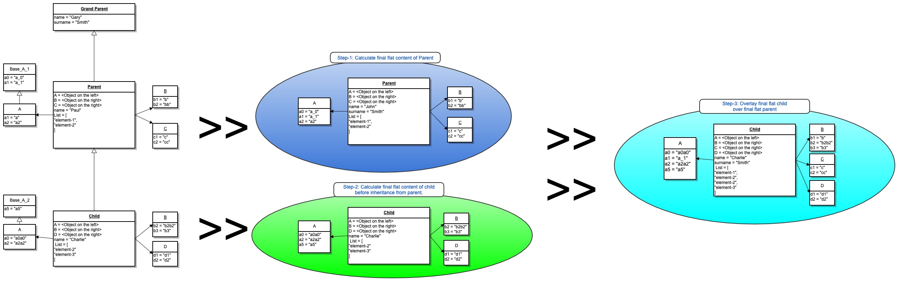
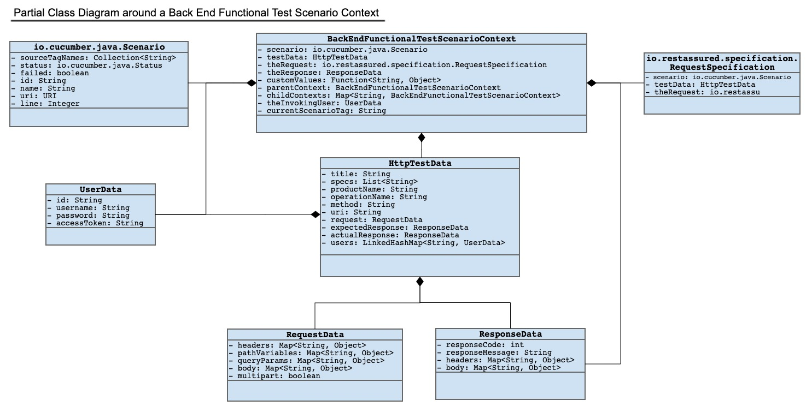
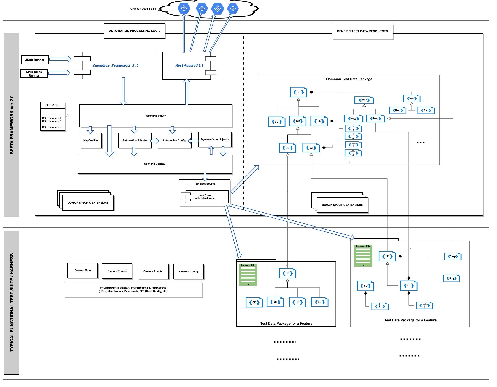
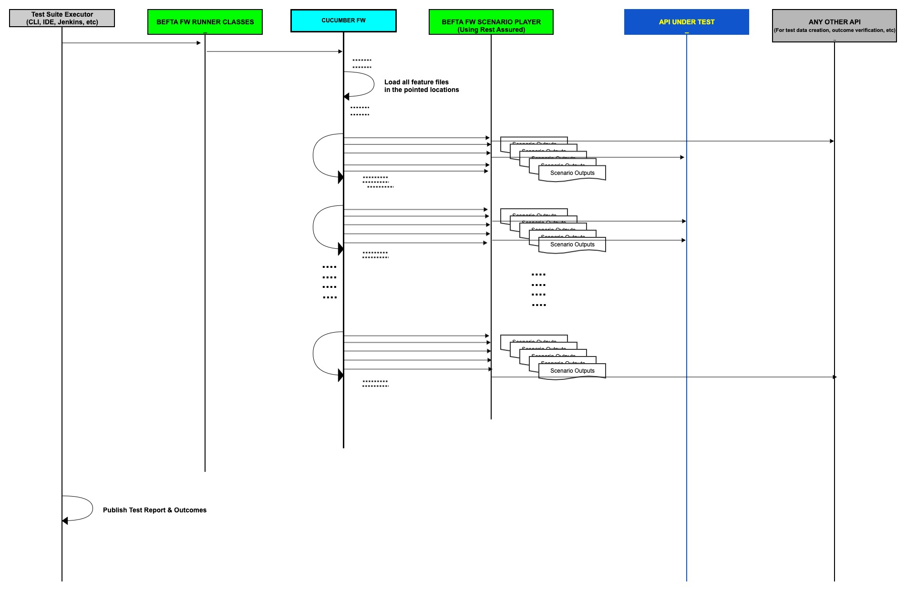

# BACK END FUNCTIONAL TEST AUTOMATION FRAMEWORK


## LICENSE

This project is licensed under the MIT License - see the [LICENSE](LICENSE) file for details.


## 1) WHAT IS BEFTA FRAMEWORK?
BEFTA Framework is a framework for automation of functional tests for http-based APIs. It uses Cucumber and Rest Assured frameworks and supports a BDD (Behaviour-Driven Development) approach to software development.


## 2) FEATURES AND CONVENIENCES PROVIDED
It provides the following functionalities and conveniences:
1.  A Domain Specific Language (DSL), which is specific to the domain of automation of http-based APIs, to describe the functional/behavioural requirements of APIs.
2.  Underlying programmatic logic to make the DSL an executable script language to execute functional tests.
3.  Flexible and efficient, JSON-based test data repository enabling test automators to define and maintain their test data with maximum re-use and minimum duplications.
4.  Fast-performing, full-range response verification, robust mechanism to assert full details of responses including response statuses, reason phrases, headers and response bodies.
5.  Dynamic data configuration means allowing dynamic & run-time-specific test data to be identified without any programming at all
6.  Custom-programmable dynamicity to allow for programmable injections into test logic
7.  Clearly designed way of adapting and integrating the framework into various API suites for any new functional test suit.
8.  Reporting, and for-diagnostic outputting
9.  Custom extensibility of out-of-the box DSL (Cucumber feature)
10. Other features coming with Cucumber Framework wrapped.


## 3) HOW TO SETUP & INTEGRATE


### 3.1) System Requirements
* System Resources (Memory, Disk, CPU) - Same for a JDK 8 installation.  
  [Click here to see Oracle's reference for this.](https://docs.oracle.com/javase/8/docs/technotes/guides/install/windows_system_requirements.html)


### 3.2) Software Requirements
* Java SE Development Kit 8 (JDK 8)
* Your Favourite IDE
* Gradle 4.10+


### 3.3) Setting Up Environment
1. Install JDK 8 or higher
2. Install a command line terminal application


### 3.4) Common Environment Variables
   Befta Framework uses the below environment variables:
   * TEST_URL: This is the base URL of the APIs to be tested.
   * IDAM_URL: This is the base URL of the API authenticating the users on behalf of which the API calls will 
     be delivered.
   * S2S_URL: This is the base URL of the API authenticating the client applications on behalf of which the API calls will 
     be delivered.
   * BEFTA_S2S_CLIENT_ID: Client ID of the application on behalf of which the API calls 
     will be delivered.
   * BEFTA_S2S_CLIENT_SECRET: Client Secret of the application on behalf of which the API calls 
     will be delivered.
   * BEFTA_RESPONSE_HEADER_CHECK_POLICY: This env var can be used optionally to switch the policy applied to mismatching 
     response header values. It can be one of IGNORE, JUST_WARN and FAIL_TEST. Default behaviour is to assume FAIL_TEST.


### 3.5) Domain Specific Environment Variables
Below are the environment needed specifically for CCD domain.
   * DEFINITION_STORE_HOST: Base URL of the Definition Store APIs.
   * CCD_IMPORT_AUTOTEST_EMAIL: Email id of the user on behalf of which definitions 
     will be imported to Definition Store, for automated test data preparation.
   * CCD_IMPORT_AUTOTEST_PASSWORD: Password of the user on behalf of which definitions 
     will be imported to Definition Store, for automated test data preparation.


### 3.6) Run BEFTA Framework Without a Build Tool
1. Download a copy of BEFTA Framework (say, version 1.2.1) in a local folder, say the root directory of an 
   IDE project in which you (will) have your automated functional tests. //TODO: fat 
   jar release of framework
2. Open your preferred terminal and change current directory to the root directory 
   of your test automation project.
3. java -cp befta-fw-1.2.1.jar uk.gov.hmcts.befta.BeftaMain 'my-feature-files/are/here, and/here, and-also/there'
   This will run the test scenarios under the local folder you specify.  
   Test automation teams can write their simple, tiny custom Main classes to customise 
   the the test suite launching logic.


### 3.7) Run BEFTA Framework With Gradle
1. Install Gradle 4.1 or higher. You can simply copy a gradle wrapper from `https://github.com/hmcts/befta-fw`.
2. Add the following dependency to your build.gradle file:  
   `testCompile group: 'uk.gov.hmcts', name: 'befta-fw', version: '1.2.1'`
3. Add a javaExec section to wherever you want a functional test suit to be executed, 
   like below:
   ```
           javaexec {
            main = "uk.gov.hmcts.befta.BeftaMain"
            classpath += configurations.cucumberRuntime + sourceSets.aat.runtimeClasspath + sourceSets.main.output + sourceSets.test.output
            args = ['--plugin', "json:${projectDir}/target/cucumber.json", '--tags', 'not @Ignore', '--glue',
                    'uk.gov.hmcts.befta.player', 'my-feature-files/are/here, and/here, and-also/there']
        }
   ```
   You can place this block inside the
   ```
   task functional(type: Test) {
      ...
   }
   ```
   of your test automation project.  
   Test automation teams can write their simple, tiny custom Main classes to customise 
   the the test suite launching logic.


### 3.8) Observe Cucumber Report

1. Open in your web browser the local Cucumber report file:  
   `./⁨target⁩/cucumber⁩/⁨cucumber-html-reports⁩/overview-features.html`


### 3.9) Integrate Functional Test Suite Executions into Pipelines

We assume you will have build pipelines making gradle calls to run your automated 
functional tests which is the case for HMCTS Reform programme as seen in the open source 
repositories. However, with the simple means of test suite executions provided above, test 
suite executions can be integrated into build pipelines using Maven or any other tools 
as well. When it comes to BEFTA, test suite execution is a simple Java call to run 
a Main class with runtime arguments to specify where the features are, where the step 
implementations are and scenarios with which tags to pick up and run. You can skip 
all runtime arguments to this Main class, in which case the default arguments will 
be:
```
'--plugin', "json:${projectDir}/target/cucumber.json", '--tags', 'not @Ignore', '--glue', 'uk.gov.hmcts.befta.player', 'src/aat/resources/features'
```


### 3.10) Setting up a Local API Application under Test
The most typical use of BEFTA Framework will include running an application in local 
machine and executing a functional test suit against it. Running such applications 
in local will require application-specific setup instructions. Once such an application 
is setup correctly, BEFTA framework can then be used to functionally verify the behavioural requirements of any http-based API in 
local. Multiple applications from totally diverse domains can be setup in a local machine 
each having their respective base URLs, and BEFTA Framework can be used for each of 
them simply switching from one configuration to another to test a set of APIs.

In the case of HMCTS Reform CCD application suite, the local setup procedure is described 
here on the [README of the ccd-docker repository](https://github.com/hmcts/ccd-data-store-api).
Obviously, to test a CCD application, for example, the proper setup procedure should 
have been completed as a prerequisite. An incomplete setup, like some users not fully 
and correctly configured, can cause some or all of the functional tests to fail as false positives.

### 3.11) Importing definition files

BEFTA Framework contains definition files in both XLSX and JSON formats.

Typically, CCD services under test will call BEFTA Framework code in order to load this definition
data before running feature tests.

The BEFTA Framework will always load the JSON definitions in `befta-fw` from the directory 
`src/main/resources/uk/gov/hmcts/befta/dse/ccd/definitions`, use them to create a XLSX file and import it to the 
ccd definition store.  

Any changes made to XLSX files in the directory `src/main/resources/uk/gov/hmcts/befta/dse/ccd/definitions/excel` will 
*NOT* be imported to the definition store.

The XLSX may be updated, rather than the JSON directly, but for these changes to take effect, they must be applied to the 
corresponding JSON files, by executing the `DefinitionConverter` class provided by BEFTA Framework.

This can be done by creating a run configuration within your IDE, providing the path to the main class 
`uk.gov.hmcts.befta.dse.ccd.DefinitionConverter`, as well as the necessary program arguments listed below.

```
    arg1: to-json | to-excel : key word to convert from excel to json or from json to excel
    arg2: input file path for excel document or parent jurisdiction folder for json version
    arg3: (Optional) output folder path for resulting json or excel file. By default will use parent folder from the input location
    arg4: (Optional) Boolean: true - use jurisdiction name to generate the parent folder name when converting from excel to JSON,
          false - use file name as the folder name
```

## 4) SAMPLE REPOSITORIES USING BEFTA FRAMEWORK

Below are a few github repositories into which BEFTA Framework 
has been successfully integrated:  


Some Spring Boot Applications:
* https://github.com/hmcts/ccd-data-store-api
* https://github.com/hmcts/ccd-definition-store-api
* https://github.com/hmcts/ccd-user-profile-api
* https://github.com/hmcts/ccd-case-document-am-api

Some Node.js Applications:
* https://github.com/hmcts/ccd-case-print-service
* https://github.com/hmcts/ccd-case-activity-api


## 5) HOW TO DEVELOP A SIMPLE AUTOMATED SCENARIO
Development of an automated test scenario takes, at a high level, the below main steps:
1. Introduce a `.feature` file of any good name, and add a test scenario composed of 
   the DSL elements available with BEFTA framework.
2. Annotate the scenario with a tag starting with `S-`. This will identify the scenario 
   uniquely to the framework. Make sure this is a unique scenario ID across the entire test 
   suite being executed in a round.
3. Introduce a test data file with a good name ending with `.td.json`. The test data 
   file should be a marshaled json content of an object of class `uk.gov.hmcts.befta.data.HttpTestData`. Make 
   sure that the '_guid_' field in the file contains exactly the same text as the `S-` 
   tag of the scenario in the `.feature` file.  
   The json-based test data can be prepared making use of inheritance mechanism provided 
   by the framework. The inheritance mechanism will be described under a separate heading. 
    
   The test data can also contain dynamic content to be calculated in the runtime, 
   in the form of pre-defined place-holders or json-path-like formulas to refer to 
   the value of any request or response details, or any programmatically computed custom 
   placeholder. The dynamic value features will be described under a separate heading. 
4. Run your test scenario and correct any issues in the test data configuration until 
   you are sure the test data is complete and correct to supply the framework with 
   the full and precise data requirements of the scenario script in the `.feature` 
   file. You can find more about how to debug your scenarios under the dedicated header 
   below.


### 5.1) Json Inheritance Mechanism - How it Works & How to Use
Attributes in an object represented by a JSON object in BEFTA-way are collated in the 
order or calculation shown in the below diagram:  



### 5.2) Dynamic Value Place-holders
The below place-holders can be used to configure test data with request details dynamically calculated 
in runtime, or with response details to specify acceptable values in API responses 
as per behavioural requirements: 


1. `DEFAULT_AUTO_VALUE`: This is used to calculate a default automatic value in runtime for 
the below specific request fields:  
* `uid`: When this is the attribute name, the value is dynamically injected as the `id 
of the user` on behalf of which the test call is being delivered.  

* `Authorization`: When this is the attribute name, the value is dynamically injected as `a 
'Bearer' token issued to the name of the user` on behalf of which the test call is being delivered.  

* `ServiceAuthorization`: When this is the attribute name, the value is dynamically injected as `a 
service to service token issued to the name of the client` on behalf of which the test call is being delivered.  

* `cid`: When this is the attribute name, the value is dynamically injected as the `id 
of a case created just before this test call, through a default case creation call`. 
This is equivalent to hacing the below formulae in the value for the attribute:  
`${[scenarioContext][childContexts][Standard_Full_Case_Creation_Data][testData][actualResponse][body][id]}`  \

2. `ANY_NULLABLE`: This is used to `accept any data of any type including null or missing 
ones` as the value of the response detail specified.  


3. `ANY_STRING_NULLABLE`: This is used to `accept any text data including null or missing 
ones` as the value of the response detail specified.  


4. `ANY_NUMBER_NULLABLE`: This is used to `accept any numeric data including null or missing 
ones` as the value of the response detail specified.  


5. `ANY_INTEGER_NULLABLE`: This is used to `accept any integral data including null or missing 
ones` as the value of the response detail specified.  


6. `ANY_FLOATING_NULLABLE`: This is used to `accept any floating point data including null or missing 
ones` as the value of the response detail specified.  


7. `ANY_DATE_NULLABLE`: This is used to `accept any date data including null or missing 
ones` as the value of the response detail specified.  


8. `ANY_TIMESTAMP_NULLABLE`: This is used to `accept any time-stamp data including null or missing 
ones` as the value of the response detail specified.  


9. `ANY_OBJECT_NULLABLE`: This is used to `accept any Object data of any type including null or missing 
ones` as the value of the response detail specified.  


10. `ANYTHING_PRESENT`: This is used to `accept any data of any type but reject null or missing 
ones` as the value of the response detail specified. It is an alias of `ANY_NOT_NULLABLE`.  


11. `ANY_NOT_NULLABLE`: This is used to `accept any data of any type but reject null or missing 
ones` as the value of the response detail specified.  


12. `ANY_STRING_NOT_NULLABLE`: This is used to `accept any text data but reject null or missing 
ones` as the value of the response detail specified.  


13. `ANY_NUMBER_NOT_NULLABLE`: This is used to `accept any numeric data but reject null or missing 
ones` as the value of the response detail specified.  


14. `ANY_INTEGER_NOT_NULLABLE`: This is used to `accept any integer data but reject null or missing 
ones` as the value of the response detail specified.  


15. `ANY_FLOATING_NOT_NULLABLE`: This is used to `accept any floating point data but reject null or missing 
ones` as the value of the response detail specified.  


16. `ANY_DATE_NOT_NULLABLE`: This is used to `accept any date data but reject null or missing 
ones` as the value of the response detail specified.  


17. `ANY_TIMESTAMP_NOT_NULLABLE`: This is used to `accept any time-stamp data but reject null or missing 
ones` as the value of the response detail specified.  


18. `ANY_OBJECT_NOT_NULLABLE`: This is used to `accept any Object data of any type but reject null or missing 
ones` as the value of the response detail specified.  


### 5.3) Injecting Values of Environment Variables:
Environment variables can be referenced between double curly braces like in `{{SOME_ENV_VAR}}`.  


### 5.4) Injecting Values from Scenario Context:
Values in the runtime scenario context can be fetched and injected into designated 
places by using the `${<field-reference-formal>}` notation. Users of this feature should 
understand the object structure of a scenario context, which is shown in the below 
diagram.  

Field reference format is a square bracketed sequence `[like][this][here]` of field 
names, map keys or array/collection indexes.

Consider the following example:  
```${[scenarioContext][childContexts][S-212_Get_Case_Data][testData][actualResponse][body][events][0][id]}```
This reference picks the `id` field of the `0`-indexed element in the `events` collection 
in the `body` of the `actualResponse` of the `testData` of the `childContext` of the 
api call `S-212_Get_Case_Data` in the `scenarioContext` of this test scenario being 
worked on.

Some nice examples of use of this feature are available in the links below:

* https://github.com/hmcts/ccd-data-store-api / [For Example](https://github.com/hmcts/ccd-data-store-api/blob/master/src/aat/resources/features/F-067/F-067_Test_Data_Base.td.json)
*
*





### 5.5) Introducing Programmable Custom Dynamic Values
Each scenario context uses a custom value calculator function to translate certain 
customised values into programmatically computed values. This function delegates its logic 
to the TestAdapter object used by the framework instance executing the test suite. This 
is done by calling the `calculateCustomValue` method of the adapter. The default implementation 
of the adapter already introduces the below custom values into the context of a scenario: 
 
1. `request`: shortcut for `[testData][request]`
2. `requestBody`: shortcut for `[testData][request][body]`
3. `requestHeaders`: shortcut for `[testData][request][headers]`
4. `requestPathVars`: shortcut for `[testData][request][pathVariables]`
5. `requestQueryParams`: shortcut for `[testData][request][queryParams]`
6. `expectedResponse`: shortcut for `[testData][expectedResponse]`
7. `expectedResponseHeaders`: shortcut for `[testData][expectedResponse][headers]`
8. `expectedResponseBody`: shortcut for `[testData][expectedResponse][body]`
9. `actualResponse`: shortcut for `[testData][actualResponse]`
10. `actualResponseHeaders`: shortcut for `[testData][actualResponse][headers]`
11. `actualResponseBody`: shortcut for `[testData][actualResponse][body]`
12. `today`: short cut for the value of the current date in `yyyy-MM-dd` format.
13. `today(<any-date-format>)`: short cut for the value of the current date in the specified 
format.
14. `now`: short cut for the value of the current system time in `yyyy-MM-dd'T'HH:mm:ss.SSS` format.
15. `now(<any-time-stamp-format>)`: short cut for the value of the current system time in the 
specified time-stamp format.


Users of BEFTA framework can override this specific method to alter the calculation for 
the above custom values, or introduce new custom values needed in their specific tests 
data requirements.


### 5.6) Special Conventions for Test Data
Test data for a functional test scenario is designed to support various nice features, 
which rely on use of certain conventions on the way the data is configured.

Ideally, BEFTA framework identifies the expected value of a response body with a JSON payload in 
the form of a field-value or key-value structure. However, not all APIs will have a 
JSON-based response payload. APIs can return files, or plain text, or encoded binary 
content representing files being downloaded. What is a better payload format for an 
API response is obviously a matter of what kind of API it is and the general design 
guidelines adopted by API providers. However, the framework is designed to allow a 
variety of such response formats. This applies to request payload formats, as well.

Moreover, when the test data is edited by automation developers for an API, the logic 
of comparison of actual and expected response details may require certain switches specified 
per local elements of test data. For example, a test data can be configured to expect 
a collection of objects in a specific field of a response, but then the ordering of 
the response may or may not be predictable if such ordering is not part of the API 
contract. Or, in the same case, the automation developer may want to expect a subset of the objects 
she/he listed in the test data artefacts, or a superset of them. There has to be a 
way to provide such verification parameters to the framework per each of such points in 
the overall verification of an API response and functionality.

Below are some special conventions to make use of flexibilities described above in general 
terms.

#### 5.6.1) Arrays at Top Level in Request and Response Bodies
If the response body of an API is meant to contain a JSON array at root 
level, the test data should follow the following convention for the body section of 
the expected response:
```
  "expectedResponse": {
    "body": {
      "arrayInMap": [
        {
          "attribute1": "value1",
          "attribute2": "value2",
          "attribute3": "value3"
        },
        {
          "attribute1": "...",
          "attribute2": "...",
          "attribute3": "..."
        },
        ...
      ]
    }
  }
```
In this example, the value of the arrayInMap field is used as the actual expected value 
of the response body. Same convention is applicable for request bodies, as well.

#### 5.6.2) Files in Request Bodies
Files can be specified to be contained in request bodies. This is useful for APIs uploading 
a file to a destination. Following is the structural convention for such a specification:
```
{
   ...
   "request": {
      "headers": {
         "Content-Type": "multipart/form-data"
      },
      "body": {
         "key": "file",
         "filePath": "some/path/to/a/resource/in/classpath/of/the/test/suite/being/executed/name.extension"
      }
   }
   ...
}
```

The request content type should be multipart, and the body should contain the 2 fields 
as shown. While placing the actual API call, the framework will stream the file designated 
by the resource path, to the request body.

To specify a more detailed 'form-data' in a request payload, fields (controls) in the 
form along with their values can be specified as below. Note that this example specifies 
multiple files to be attached to the same request body.
```
   "body": {
       "arrayInMap": [
          {
            "key": "some-form-field",
            "value": "some-value"
          },
          {
             "key": "some-other-form-field",
             "value": "some other value"
          },
          {
             "key": "files",
             "filePath": "SampleImage1.png"
          },
          {
             "key": "files",
             "filePath": "some/path/SampleImage2.png"
          },
          {
             "key": "files",
             "filePath": "some/path/SampleImage3.png"
          }
      ]
   }
```


#### 5.6.3) Files in Response Bodies
If a file content is expected in a response body, the framework can be instructed to 
check if the actual size of the download file is equal to that of the expected one.
Below is the convention for such instruction:

```
   "__fileInBody__" : {
      "fullPath" : "[[ANY_STRING_NOT_NULLABLE]]",
      "size" : "679361",
      "contentHash" : "[[ANY_STRING_NOT_NULLABLE]]"
   }
```

The fullPath and contentHash fields are intended to be used in the future. So, they 
can for now be configured to accept any String except for null.

#### 5.6.4) Conventions for Expected Collections
When a collection of objects are expected in any place in a response, that can be specified 
as an array of those objects in the test data. When so done in the simplest manner, the 
framework will compare every element in the array with the corresponding, same-indexed 
element in the actual response. Any extra element or missing element will be clearly 
identified. Any unacceptable value in any field in any element will fail the test clearly 
being reported. However, if the expected collection does not have to be returned in 
a particular order, the framework should be instructed of that with a simple object 
as the first element in the expected data array. That first element will be recognised 
by the framework as an instructive configuration and the array's second element will 
be treated as the first data object intended to be listed. The instructive configuration 
element should be as below:

```
"some-collection-field": [
   {
      "__operator__": "equivalent",
      "__ordering__": "unordered",
      "__elementId__": "id"
   },
   {
      "id": "first object",
      "field": "First"
   },
   {
      "id": "second object",
      "field": "Second"
   },
   {
      "id": "third object",
      "field": "First tab"
   }
]
```
Here are the 3 fields in this convention:
* "__operator__" field:
This one represents the mode of comparison of expected and actual content of the collection. It can be one of `equivalent`, `subset` and `superset`. 
Default is `equivalent` and the field can be omitted if that's the preferred one. Subset 
and superset comparisons have not yet been implemented.

* "__ordering__" field:
This one represents whether the elements in the array are has to be compared in the 
order provided in the test data. It can be one of `ordered`, and `unordered`.
Default is `ordered` and the field can be omitted if that's the preferred one.

* "__elementId__" field:
This one represents the field names in the data objects which form up a unique key. 
Default is `id` and the field can be omitted if there is a field "id" in data objects as 
a unique key.
In the case of unordered equivalence check, this field is of no effect.
In all other cases, the default or specified value of this instructive configuration 
is essential for the framework to be able to decide which object in the actual response 
should be compared to which one in the expected response.


An example test data file is [here](https://github.com/hmcts/ccd-data-store-api/blob/develop/src/aat/resources/features/F-051/S-109.td.json) showing a 
nested use of this feature.


## 6) INTRODUCING PROGRAMMATIC LOGIC INTO TEST SUITES
Befta framework allows programmatic extensibility in various ways.
* Custom main classes or runners:
Automation developer can write their own main classes or runners to introduce customised 
logic to be executed before and after the execution of test suites.
* Custom automation adapter:
A custom implementation of [TestAutomationAdapter interface](https://github.com/hmcts/befta-fw/blob/master/src/main/java/uk/gov/hmcts/befta/TestAutomationAdapter.java) or 
an extension of [DefaultTestAutomationAdapter class](https://github.com/hmcts/befta-fw/blob/master/src/main/java/uk/gov/hmcts/befta/DefaultTestAutomationAdapter.java) can be implemented and injected into the framework from 
a main class or runner. An example is [here](https://github.com/hmcts/ccd-data-store-api/blob/master/src/aat/java/uk/gov/hmcts/ccd/datastore/befta/DataStoreTestAutomationAdapter.java).
 
A custom implementation of `Object calculateCustomValue(BackEndFunctionalTestScenarioContext scenarioContext, Object key)` 
in an adapter implementation can be particularly useful in introducing fully flexible verification 
logic in any level of detail in responses. A good example is available [here](https://github.com/hmcts/ccd-case-document-am-api/blob/development/src/functionalTest/java/uk/gov/hmcts/ccd/documentam/befta/CaseDocumentAmTestAutomationAdapter.java).

* Adding customised step implementations:
Automation developers can write their own step implementation classes and glue them 
to the feature files, just as a typical feature of Cucumber framework.

* Other methods:
Thanks to the broad range of features of Java language and platform, various other ways 
of introducing custom logic into test suites can be improvised. The framework doesn't 
bring any limitations to such flexibilities.


## 7) HOW TO DEBUG TEST SUITES
Test scenarios can be run in debug mode on any modern IDE. All it takes to do so is 
to have a simple Runner class like the example [here](https://github.com/hmcts/ccd-data-store-api/blob/master/src/aat/java/uk/gov/hmcts/ccd/datastore/befta/DataStoreBeftaRunner.java). 
and run that runner class in debug mode of the IDE. Doing so, the automation developer 
can trace the execution of scenarios, which may many times be very convenient to quickly 
resolve any test issue. Runner classes will need environment variables set for them, 
and they can either be inherited automatically from the platform by the IDE, or can 
be copy-pasted into Run configurations of IDEs.


## 8) LOW-LEVEL DESIGN
BEFTA Framework has been designed at a low level to contain components and their interactions as depicted in the below diagram. 
 \


Typical sequence of activities during the execution of test suite is as shown in the 
below Sequence Diagram:


